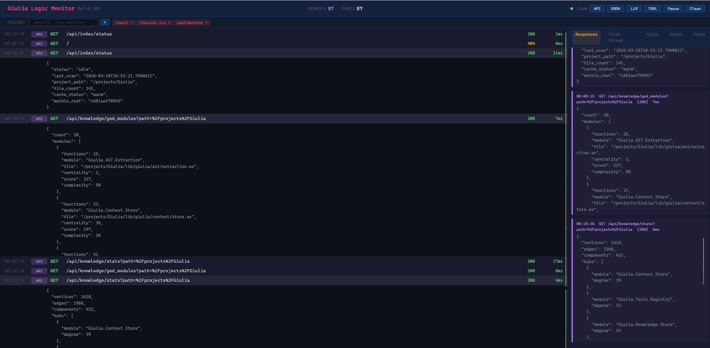
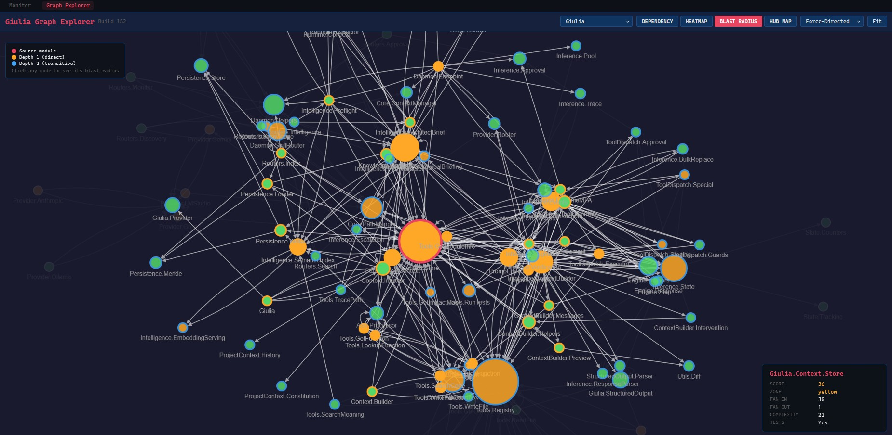

# Giulia

> **Build 159** · v0.3.3 · 2026-04-27





> **Giulia is read-only.** It scans and analyzes your codebase but **never modifies your files**. No LLM inside, no autonomous actions, no code generation. It reads source files, builds data structures in memory, and serves structured data over HTTP. The only thing it writes to disk is its own cache (`.giulia/cache/`).

Giulia is a persistent, local-first code intelligence daemon built in Elixir/OTP. It runs as a long-lived background process with multi-project awareness, providing AST-level code intelligence, a Property Graph, runtime BEAM introspection, and semantic search -- via both a REST API and native MCP (Model Context Protocol) integration.

## Why Giulia Exists

AI coding assistants restart from zero every session. They lose context, re-index files, and grep for everything on every interaction. Giulia solves this by running as a long-lived daemon on the BEAM VM:

- **Warm state**: AST indexes, Property Graphs, and embeddings stay in ETS between sessions.
- **Multi-project**: Switch terminals and projects instantly -- each gets its own isolated context.
- **No cold starts**: CubDB persistence restores full state on restart without re-scanning.
- **Deep analysis**: Dependency graphs, blast radius, coupling metrics, and dead code detection -- precomputed and cached, not computed on every query.

## What It Does

### Static Analysis (L1 -- ETS + libgraph)

Sub-millisecond queries over the full project graph. Modules, functions, dependencies, centrality, impact maps, coupling heatmaps, complexity scores. All built from Sourceror AST parsing with parallel file scanning.

### Runtime Introspection

Connect to any running BEAM node via distributed Erlang. Inspect memory, top processes, hot modules, and fuse runtime data with static analysis for performance profiling. Worker and monitor containers operate as a two-node cluster.

### Persistent Intelligence

- **CubDB warm starts**: AST entries, property graph, metric caches, and embeddings survive restarts. Merkle tree integrity verification detects stale files for incremental re-scanning.
- **ArcadeDB L2**: Multi-model graph database for cross-build history, consolidation queries, complexity drift detection, and coupling trend analysis.

### External Tool Enrichment

Giulia ingests output from existing Elixir tools — **Credo and Dialyzer ship today**; ExUnit coverage / ExDoc / Sobelow share the same scaffolding — and attaches each finding to the corresponding function or module vertex in the knowledge graph. `pre_impact_check` and `dead_code` then surface "47 callers, blast radius wide, AND this function has 2 outstanding type warnings" instead of either signal in isolation. Pluggable behaviour (`Giulia.Enrichment.Source`) + JSON registry (`priv/config/enrichment_sources.json`) with per-tool severity maps — adding a new tool is one parser module + one JSON entry. Tool findings live in their own CubDB keyspace and are preserved across source rescans (CI cadence is decoupled from extractor cadence).

## Quick Start

### Prerequisites

- Docker Desktop with Compose v2 plugin (`docker compose`, not `docker-compose`)
- Git

### Build and Start

```bash
git clone https://github.com/thatsme/giulia.git
cd giulia

# Build the Docker image
docker compose build

# Start worker (port 4000) + monitor (port 4001)
docker compose up -d

# Verify
curl http://localhost:4000/health
```

### First Scan

```bash
# Scan a project (use the host path -- Giulia translates it to the container path)
curl -X POST http://localhost:4000/api/index/scan \
  -H "Content-Type: application/json" \
  -d '{"path":"/path/to/your/project"}'

# Get the architect brief (full project awareness in one call)
curl "http://localhost:4000/api/brief/architect?path=/path/to/your/project"
```

## Architecture

```
Claude Code / CLI Client
         |
         | HTTP (REST) or MCP
         v
+------------------+     +-------------------+
| giulia-worker    |     | giulia-monitor    |
| :4000            |<--->| :4001             |
| Static analysis  |  ^  | Runtime profiling |
| Scans, graphs,   |  |  | Burst detection   |
| embeddings       |  |  | Performance data  |
| MCP server       |  |  |                   |
+------------------+  |  +-------------------+
  |          |        |
  v          v        | Distributed Erlang
+------+  +-------+  |
| ETS  |  | CubDB |  +---> External BEAM apps
| (L1) |  | (warm |
|      |  | start)|
+------+  +-------+
              |
              v
         +-----------+
         | ArcadeDB  |
         | (L2)      |
         | :2480     |
         | History,  |
         | trends,   |
         | cross-    |
         | build     |
         +-----------+
```

## Documentation

| Document | Description |
|---|---|
| [INSTALLATION.md](INSTALLATION.md) | Prerequisites, setup, configuration, troubleshooting |
| [ARCHITECTURE.md](ARCHITECTURE.md) | System design, OTP supervision tree, data flow, 11 graph-builder passes |
| [docs/CONFIGURATION.md](docs/CONFIGURATION.md) | Per-variable reference for `priv/config/*.json` (scoring, dispatch patterns, scan roots) and the cache-invalidation contract |
| [API.md](API.md) | REST API and MCP reference (83+ endpoints across 10 categories) |
| [docs/REPORT_RULES.md](docs/REPORT_RULES.md) | Standard report-generation procedure for AI agents and humans |
| [TESTING.md](TESTING.md) | Test environment setup, running tests, conventions |
| [CONTRIBUTING.md](CONTRIBUTING.md) | Development workflow, build counter rules, PR process |
| [CODING_CONVENTIONS.md](CODING_CONVENTIONS.md) | Code style, patterns, naming conventions |
| [SECURITY.md](SECURITY.md) | Path sandboxing, constitution enforcement, threat model |

## Visual Dashboards

### Logic Monitor (`/api/monitor`)

Real-time cognitive flight recorder. Every REST call, inference step, LLM call, and tool execution streams via SSE. Project-scoped filtering lets you isolate events per codebase when analyzing multiple projects.

### Graph Explorer (`/api/monitor/graph`)

Interactive dependency graph visualization powered by Cytoscape.js. Four views:
- **Dependency Graph**: Full module topology, nodes colored by heatmap zone (red/yellow/green), sized by centrality
- **Heatmap**: Emphasizes risky modules, dims healthy ones
- **Blast Radius**: Click any module to see depth-1/2 impact propagation
- **Hub Map**: Highlights high-degree modules

Supports force-directed, hierarchical, circle, and concentric layouts. Click any node for score, centrality, complexity, and test coverage details.

## Self-Analysis Demo

Giulia can analyze herself. The reports below were generated by pointing Giulia's API endpoints at her own codebase — the same analysis available for any Elixir project.

**[Giulia Self-Analysis Report (Build 146, PDF)](giulia_reports/Giulia_REPORT_2026032411.pdf)**

Highlights from the self-analysis:
- 143 modules, 1,471 functions, 1,614 graph vertices, 1,964 dependency edges
- 729 specs covering 79.9% of public functions, 0 dead code, 0 orphan specs
- 0 circular dependency cycles, 0 behaviour fractures
- Context.Store.Query has a 49-module blast radius (34% of codebase within 2 hops)
- 0 unprotected hubs — all high-fan-in modules have adequate spec coverage
- Runtime: 120 MB memory, 545 processes, 0 scheduler pressure

## Project Status

- **Version**: v0.3.3 (Build 159)
- **Tests**: ~1030 unit/integration tests in the focused subsets (ast/ + knowledge/ + persistence/ + context/ + tools/ + enrichment/) + 13 StreamData property tests + 7 golden-fixture tests for extraction output
- **Cross-store invariants**: `GET /api/knowledge/verify_l2` and `verify_l3` endpoints run on every mix-test invocation, with drift-detection tests that tamper L2/L3 state and assert the verifier catches the mismatch
- **API**: 85+ self-describing endpoints across 10 categories (core, discovery, index, knowledge, intelligence, runtime, search, transaction, approval, monitor)
- **MCP**: Native Model Context Protocol server — 71+ tools + 5 resource templates, bearer token auth
- **Storage**: Three-tier (ETS L1 + CubDB L2 + ArcadeDB L3) with startup warm-restore from L2 so `/api/projects` stays populated across `docker compose restart`. L2 cache auto-invalidates on code-tier or config-file edits via the CodeDigest envelope
- **Containers**: Dual-container architecture (worker + monitor)
- **Visualization**: Logic Monitor (SSE) + Graph Explorer (Cytoscape.js)
- **Graph synthesis**: 11 builder passes from AST to graph. Passes 7-11 synthesize edges for runtime-dispatched call sites the static walker can't resolve directly (defprotocol/defimpl, behaviour callbacks, Phoenix router actions, MFA tuples, `&` captures, `apply/3`, `Task.start_link(M, F, A)` form, and unqualified calls resolved through `use M`-injected imports). Universal mechanisms — no project-specific allowlists
- **Dead-code categorization**: every `dead_code` entry classified (`genuine | test_only | library_public_api | template_pending | uncategorized`) so consumers see actionable vs irreducible residuals at a glance
- **External tool enrichment**: pluggable ingestion of Credo and Dialyzer output (47-warning catalogue covered) attached to graph vertices and surfaced inline in `pre_impact_check` and `dead_code`. Decoupled from source-extraction lifecycle
- **Tunability**: Heatmap and change_risk scoring constants live in [`priv/config/scoring.json`](priv/config/scoring.json); runtime-dispatch patterns in [`priv/config/dispatch_patterns.json`](priv/config/dispatch_patterns.json); source-roots in [`priv/config/scan_defaults.json`](priv/config/scan_defaults.json); enrichment sources + per-tool severity maps in [`priv/config/enrichment_sources.json`](priv/config/enrichment_sources.json). All four trigger automatic L2 metric-cache invalidation when edited (see [docs/CONFIGURATION.md](docs/CONFIGURATION.md))

## License

Copyright 2026 Alessio Battistutta

Licensed under the Apache License, Version 2.0. See [LICENSE](LICENSE) for details.
